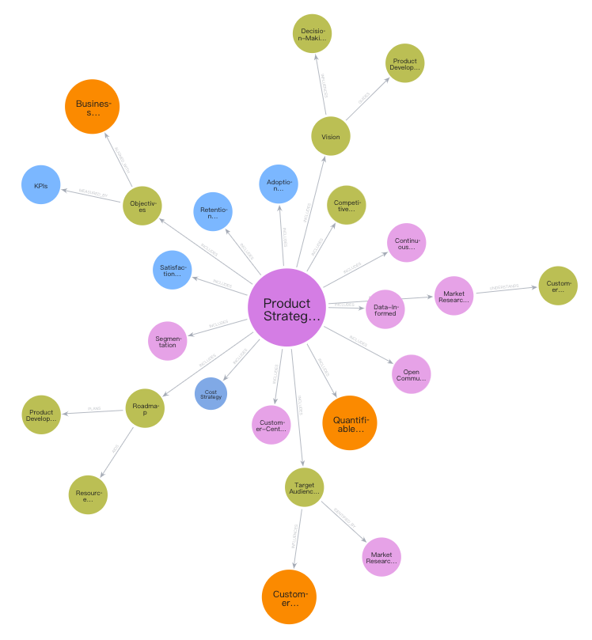

# StrategyKG
StrategyKG is an open-source knowledge graph designed for strategic AI applications. It provides meaningful knowledge representations and tools to enhance strategic planning and decision-making, enabling AI systems to offer more informed and effective strategic insights.

## Introduction to Knowledge Graphs
Knowledge graphs are structured representations of knowledge that capture the relationships between entities. They serve as powerful tools for organizing and querying complex information, making it easier to understand and utilize.

## Importance of Knowledge Graphs for Strategic AI Applications
Developing strategic-level applications is highly difficult, requiring AI systems to provide specialized advice and solve intricate problems. Large language models, while powerful, need to be augmented with knowledge graphs to enhance their capabilities in delivering domain-specific recommendations and addressing complex issues. StrategyKG is designed to support the development of strategic AI applications by providing a rich and structured knowledge base.

## Maturity Levels of StrategyKG
Building a knowledge graph is a complex and long-term endeavor that requires a substantial amount of accurate documentation and the establishment of effective datasets. To meet the diverse needs of users and advance the development of StrategyKG, we have defined a maturity model. The maturity model contains four levels, each tailored to different user needs and providing specific content under different licensing agreements.

| **Maturity Level** | **0 - Starter** | **1 - Learner** | **2 - Executor** | **3+ - Strategist** |
|--------------------|----------------|----------------|------------------|--------------------|
| **Suitable Users** | Newcomers to strategic planning | Individuals seeking to expand their strategic knowledge | Practitioners implementing and monitoring strategies | Experienced strategists requiring complex strategic planning and innovation |
| **Content Provided** | Basic concepts, simple frameworks, and introductory case studies | Advanced frameworks, industry-specific analyses, and strategy formulation tools | Strategic optimization methods, competitive analysis, and risk management tools | Strategic innovation methods, complex models, global strategy analyses, and decision support systems |
| **License Agreement** | CC0 (Public Domain) | CC0 (Public Domain) | CC BY 4.0 (Attribution Required) | Commercial Use (Contact for Licensing) |

## Getting Started
To get started with StrategyKG, simply clone the repository and explore the resources available at each maturity level. We welcome contributions from the community to enrich the knowledge graph and support strategic AI applications.

## Contributing
We encourage contributions to StrategyKG. Whether you're a newcomer or an experienced strategist, your insights and expertise can help enhance this knowledge graph. Please refer to our [Contribution Guidelines](.gitbub/CONTRIBUTING.md) for more information.

## Contact
If you are interested in a business partnership with this open-source project, please contact [open@strategylogic.cn](mailto:open@strategylogic.cn).