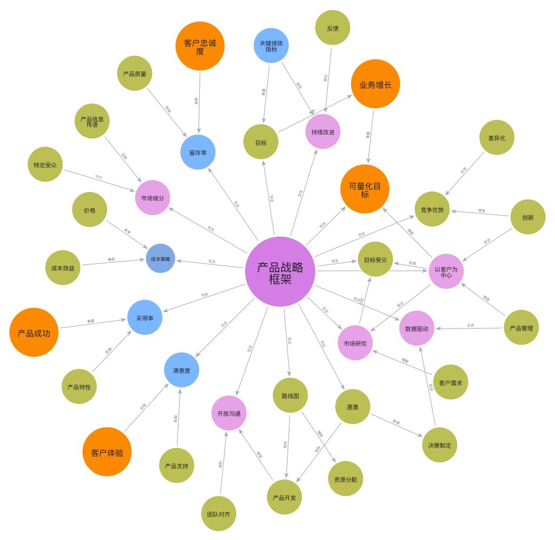

# StrategyKG
StrategyKG 是一个为战略 AI 应用设计的开源知识图谱。它提供了有意义的知识表示和工具，以增强战略规划和决策制定，使 AI 应用程序能够提供更明智、更有效的战略洞察。

## 知识图谱的概念
知识图谱是知识的结构化表示，能够捕捉实体之间的关系。它们作为强大的工具，用于组织和查询复杂信息，使其更容易理解和利用。

## 知识图谱对战略 AI 应用的重要性
开发战略级应用是一项高难度的任务，需要 AI 应用程序能够提供专业建议并解决复杂问题。尽管大型语言模型功能强大，但它们需要结合知识图谱来增强其在提供特定领域建议和解决复杂问题方面的能力。StrategyKG 旨在通过提供丰富且结构化的知识库来支持战略 AI 应用的开发。

## StrategyKG 战略知识建模
战略是复杂推理，符号表示与向量表示都难以直接描述策略的应用关系。StrategyKG 基于认知科学中的"抽象阶梯"定义出战略知识的四个层次，使战略知识建模呈现立体化，以进一步探索复杂推理的应用。每个级别将在不同的许可协议下提供特定的内容，以平衡开源与商业，使两者相互促进。

|    | 层次    | 抽象级别 | 知识类型  | 时间维度 | 许可协议 |
| ----- | ----- | ---- | ----- | ---- | ---- |
| 第0层   | 概念层   | 高阶抽象 | 理论性知识 | 无时间性 | CC0（公开） |
| 第1层   | 分类层 | 中阶抽象 | 领域知识  | 长期趋势 | CC0（公开） |
| 第2层   | 实体层   | 低阶抽象 | 事实性知识 | 历史时态 | CC BY 4.0（署名公开） |
| 第3层   | 动态层   | 具体实例 | 过程性知识 | 实时流  | 商业使用（需要许可） |

## 战略 AI 应用能力成熟度模型
构建知识图谱是一项复杂且长期的工作，需要大量准确的文档和有效的数据集。为了满足不同用户的需求并推动 StrategyKG 的成长，我们采用能力成熟度模型来衡量基于知识图谱（与大语言模型）的战略 AI 应用的发展路径。战略 AI 应用能力成熟度模型包含四个级别，每个级别都针对不同的用户需求，并在不同的许可协议下提供特定的内容。

| **成熟度级别** | **0 - 新手** | **1 - 学习者** | **2 - 执行者** | **3+ - 战略家** |
|----------------|------------------------|--------------------------|---------------------------|-----------------------------|
| **适用用户** | 初次接触战略规划的用户 | 希望扩展战略知识的个人 | 实施和监控战略的从业者 | 需要复杂战略规划和创新的资深战略家 |
| **AI能力** | 基础概念、简单框架和入门案例研究 | 高级框架、行业特定分析和战略制定工具 | 战略优化方法、竞争分析和风险管理工具 | 战略创新方法、复杂模型、全球战略分析和决策支持系统 |

## 入门指南
要开始使用 StrategyKG，只需克隆该仓库并探索每个成熟度级别提供的资源。我们欢迎社区成员贡献自己的力量，丰富知识图谱，支持战略 AI 应用。

## 贡献指南
我们鼓励您为 StrategyKG，只需克隆该仓库并探索每个成熟度级别提供的资源。我们欢迎社区成员贡献自己的力量，丰富知识图谱，支持战略 做出贡献。无论您是新手还是经验丰富的战略家，您的见解和专业知识都有助于完善这一知识图谱。请参阅我们的[贡献指南](.github/CONTRIBUTING_zh.md)以获取更多信息。

## 联系我们
如果您对本开源项目有商业合作兴趣，请通过[open@strategylogic.cn](mailto:open@strategylogic.cn)与我们联系。