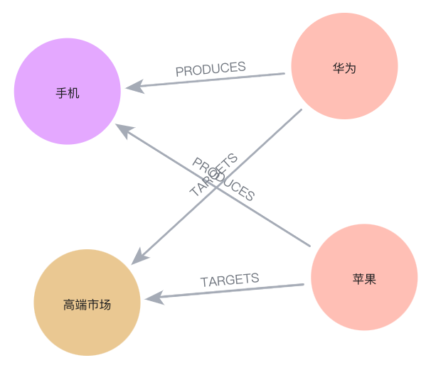

> 数字化带来的海量数据使信息收集和处理难度大增，传统方式已难满足企业对复杂决策的需求。CBInsights调查显示，数据挑战是战略实施失败的第二大原因，40%的战略部门受此困扰。知识图谱作为一种精准的知识表示方法，正在成为企业级AI应用的核心推动技术之一，也为战略工作带来全新的信息技术视角。

StrategyKG是专为战略AI应用提供支持的开放知识图谱，这是一个实例化项目，将直接交付与大模型集成的图数据，而非知识图谱的提取或相关工具。我们欢迎与知识图谱或知识库工具商合作，以增强推理知识表示的技术实现。

本文将介绍知识图谱的推理原理，探讨其如何改进了传统关系型结构数据的缺陷，从而能够为战略决策提供精准、高效的信息处理支持。

## 1. 数据到价值：信息处理技术质变

数字化时代，信息量呈爆炸式增长，海量数据的收集和处理成本显著上升。在战略领域，决策者需要从海量信息中快速提取有价值的知识，以支持复杂的战略规划和决策。然而，传统信息处理方式，尤其是关系型数据库，在面对这些需求时显得力不从心。

关系型数据库基于ER图设计，通过实体、属性和关系的定义来组织数据。这种结构虽然能够有效地存储和管理数据，但本质是一种描述性工具，仅能以陈述式的方式描述实体之间的关系，而无法进行逻辑推理。

> 例如，ER图可以表示“学生”和“课程”之间的“选修”关系，但除非记录所有学生与课程的完整关系，无法从局部关系中推断出“所有选修了课程A的学生是否也选修了课程B”。

这种低维信息处理能力在面对复杂查询和多维度数据分析时，需要不断扩充结构和关系事实记录，处理成本也急剧上升。这正是基于关系型数据库的传统IT应用的缺陷，需要记录完整的信息和所有规则，缺乏规模应用效应但又必需的IT系统，或大量体现为企业定制化需求，开发成本与业务收益显著不成正比。

知识图谱作为一种新兴的结构化知识表示方法，通过实体、关系和属性的组合来描述复杂的信息网络。知识图谱不仅能够存储大量的信息，更在于其强大的推理能力，其基础是谓词逻辑。通过引入谓词逻辑，知识图谱能够实现信息从低维到多维、高维的处理，从而为复杂决策提供高效信息支持。在战略AI领域，知识图谱能够帮助企业高效获取市场动态、竞争对手以及潜在合作机会的相关信息，为需要高级信息处理的战略决策带来巨大的价值。

接下来将探讨知识图谱推理、谓词逻辑以及图计算的实现，揭示这些技术如何为战略决策提供更精准、更高效的支持。

## 2. 谓词逻辑：知识图谱推理的基础

谓词逻辑是一种形式化的逻辑系统，通过谓词变量和量词符号来表达个体的属性和关系，并支持逻辑推理。在知识图谱中，谓词逻辑为推理提供了强大的工具，使得系统能够根据已有的事实推导出新的结论，而无须更多对应的数据记录。

与关系型数据结构一样，在知识图谱中，陈述式声明是表达事实的基本方式。下面使用谓词变量来表示小米与华为的竞争关系：

$$C(\text{小米}, \text{华为})$$

$C(x, y)$ 表示个体 $x$ 和个体 $y$ 是竞争对手。陈述式声明依赖于事实，即我们需要明确知道小米和华为是竞争对手这一事实。然而，这种声明无法判定真假，如果其他人不知道小米与华为是否竞争对手的事实，他就无法判断陈述的真假。其次，陈述式声明也无法进行推理，即依赖于定义者掌握“所有事实”。

例如，加入联想、微软、大众等其他企业，仅凭小米与华为的竞争关系，无法推断小米或华为与其他企业的关系。

### 2.1 构造逻辑关系

可以引入逻辑关系来克服陈述式声明的局限性。例如，增加“生产同类产品”作为一个逻辑来判断竞争关系的条件：

$$\forall x \, \forall y \, (P(x) \land P(y) \land x \neq y \rightarrow C(x, y))$$

$P(x)$ 表示个体 $x$ 生产手机。通过这个逻辑关系，可以判断小米和华为是否生产同类产品，从而推断它们是否存在竞争关系。

进一步，可以增加“产品在同一市场中销售”作为更细致的竞争关系判断条件：

$$\forall x \, \forall y \, (P(x) \land P(y) \land M(x) \land M(y) \land x \neq y \rightarrow C(x, y))$$

$M(x)$ 表示个体 $x$ 的产品在同一市场中销售。通过引入一系列逻辑关系，可以更准确地判断实体之间更高一层级上的关系。

### 2.2 谓词逻辑推理

假设已知以下事实：

- 小米生产手机，且面向低端市场。
- 华为生产手机，且面向高端市场。
- 苹果生产手机，且面向高端市场。

可以通过以下逻辑关系来推理竞争关系：

$$\forall x \, \forall y \, \forall z \, \forall w \, (M(x, z) \land M(y, z) \land T(x, w) \land T(y, w) \land x \neq y \rightarrow C(x, y))$$

- $M(x, z)$ 表示公司 $x$ 生产产品 $z$。
- $T(x, w)$ 表示公司 $x$ 的产品面向目标市场 $w$。
- $C(x, y)$ 表示公司 $x$ 和公司 $y$ 是竞争对手。

根据已知事实，可以具体化这些逻辑表达式：

**小米和华为**

小米生产手机，面向低端市场： $$M(\text{小米}, \text{手机}) \land T(\text{小米}, \text{低端市场})$$
华为生产手机，面向高端市场： $$M(\text{华为}, \text{手机}) \land T(\text{华为}, \text{高端市场})$$

由于小米和华为面向不同的市场，它们不是竞争对手：

$$\neg C(\text{小米}, \text{华为})$$

**小米和苹果**

苹果生产手机，面向高端市场： $$M(\text{苹果}, \text{手机}) \land T(\text{苹果}, \text{高端市场})$$

由于小米和苹果面向不同的市场，它们不是竞争对手：

$$\neg C(\text{小米}, \text{苹果})$$

**华为和苹果**

由于华为和苹果面向相同的市场，它们是竞争对手： 

$$C(\text{华为}, \text{苹果})$$

通过谓词逻辑推理，实体间的“关系”不是基于新的事实记录，而是从已有的事实推导出新的“结论”，当新增某个事实时，可以基于现有逻辑直接推理出新的关系，从而极大降低数据收集、处理的工作量，并为决策提供更精准、可回溯和证伪的推理支持，它正是知识图谱推理的基础。例如，当小米面向高端市场时，可以直接推理出与华为、苹果形成了新的竞争关系，准确及时地发出“战略预警”。

## 3. 知识图谱的表示

在知识表示中，可计算性代表将现实世界中的信息转化为计算机可以理解和处理的形式，它定义了知识表示的数据结构（Schema）。常见的知识图谱表示方法包括OWL（Web本体语言）和Cypher语法定义的图结构。

### 3.1 OWL表示

OWL是一种基于RDF（资源描述框架）的本体建模语言，广泛用于知识表示和语义网。通过定义类、属性和个体，OWL能够以结构化的方式表示复杂的信息。下面使用OWL来表示小米、华为和苹果之间的竞争关系：

```turtle
# 定义类和属性
@prefix : <http://example.org/> .
@prefix owl: <http://www.w3.org/2002/07/owl#> .
@prefix rdf: <http://www.w3.org/1999/02/22-rdf-syntax-ns#> .
@prefix rdfs: <http://www.w3.org/2000/01/rdf-schema#> .

:Company a owl:Class .
:Product a owl:Class .
:MarketSegment a owl:Class .

:produces a owl:ObjectProperty ;
    rdfs:domain :Company ;
    rdfs:range :Product .

:targets a owl:ObjectProperty ;
    rdfs:domain :Company ;
    rdfs:range :MarketSegment .

:isCompetitorOf a owl:ObjectProperty ;
    rdfs:domain :Company ;
    rdfs:range :Company .

# 表示个体
:小米 a :Company .
:华为 a :Company .
:苹果 a :Company .
:手机 a :Product .
:低端市场 a :MarketSegment .
:高端市场 a :MarketSegment .

# 表示具体关系
:小米 :produces :手机 .
:华为 :produces :手机 .
:苹果 :produces :手机 .

:小米 :targets :低端市场 .
:华为 :targets :高端市场 .
:苹果 :targets :高端市场 .
```

在OWL中，推理规则可以通过SWRL（Semantic Web Rule Language）来表达。定义一个SWRL规则来推理竞争对手关系：

```turtle
:produces(?x, ?p) ^ :produces(?y, ?p) ^ :targets(?x, ?m) ^ :targets(?y, ?m) ^ owl:differentFrom(?x, ?y) -> :isCompetitorOf(?x, ?y)
```

`:produces(?x, ?p)`：表示公司 $x$ 生产产品 $p$。
`:produces(?y, ?p)`：表示公司 $y$ 生产产品 $p$。
`:targets(?x, ?m)`：表示公司 $x$ 的产品面向目标市场 $m$。
`:targets(?y, ?m)`：表示公司 $y$ 的产品面向目标市场 $m$。
`owl:differentFrom(?x, ?y)`：表示 $x$ 和 $y$ 是不同的公司。
`:isCompetitorOf(?x, ?y)`：表示 $x$ 和 $y$ 是竞争对手。

### 3.2 Cypher语法

Cypher是Neo4j图数据库的查询语言，它通过节点和关系的组合来表示知识图谱。使用Cypher语法可以在Neo4j中创建、存储和查询知识图谱：

```cypher
// 创建公司节点
CREATE (xiaomi:Company {name: '小米'})
CREATE (huawei:Company {name: '华为'})
CREATE (apple:Company {name: '苹果'})

// 创建产品节点
CREATE (phone:Product {name: '手机'})

// 创建目标市场节点
CREATE (lowEnd:MarketSegment {name: '低端市场'})
CREATE (highEnd:MarketSegment {name: '高端市场'})

// 创建公司生产产品的关系
CREATE (xiaomi)-[:PRODUCES]->(phone)
CREATE (huawei)-[:PRODUCES]->(phone)
CREATE (apple)-[:PRODUCES]->(phone)

// 创建公司面向目标市场的关系
CREATE (xiaomi)-[:TARGETS]->(lowEnd)
CREATE (huawei)-[:TARGETS]->(highEnd)
CREATE (apple)-[:TARGETS]->(highEnd)
```

通过Cypher查询判断两个公司是否是竞争对手：

```cypher
MATCH (c:Company)-[:PRODUCES]->(p:Product), (c)-[:TARGETS]->(m:MarketSegment)
WITH p, m, COLLECT(c.name) AS companies
WHERE size(companies) > 1
RETURN p.name AS Product, m.name AS MarketSegment, companies
```

查结结果如下，它显示了两家公司在同一市场存在某个产品竞争：


查询图结构如下：

```cypher
MATCH (c1:Company)-[p1:PRODUCES]->(p:Product)<-[p2:PRODUCES]-(c2:Company),
      (c1)-[t1:TARGETS]->(m:MarketSegment)<-[t2:TARGETS]-(c2)
WHERE c1 <> c2
RETURN c1, c2, p, m, p1, p2, t1, t2
```

结果图如下所示，显示了两家公司在产品与市场之间的交叉重叠关系。



随着AI技术的不断发展，知识图谱与图计算正在为战略决策带来新的机遇，其核心在于逻辑设计。StrategyKG作为战略领域的创新型项目，将与技术人员、用户一起成长，共同探索知识图谱在战略AI领域的无限可能。